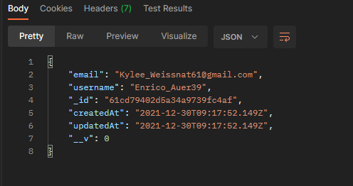

# multiFA
Multi-factor Authentication.

Includes user registration backend.

## Getting Started
### Prerequisites
Install these:
* [Node.js](https://nodejs.org/en/)
* [Postman](https://www.postman.com/)
* [MongoDB Compass](https://www.mongodb.com/products/compass)

These should be globally installed:
* [TypeScript](https://www.typescriptlang.org/download) `npm install -g typescript`
* [ts-node](https://www.npmjs.com/package/ts-node) `npm install -g ts-node`

### Installation
(Type these commands by opening the command prompt (for windows) in the root directory of this repository)\
Install project packages
```
npm install
```
### Build
To start the server (runs nodemon for `src/server/app.ts`):
```
npm run server
```

You can then open postman.

## Output
Open postman and create a POST HTTP request along with the body as shown below and send the request.\


You should see a similar json as shown below.\


The user details should also be added to the database.

