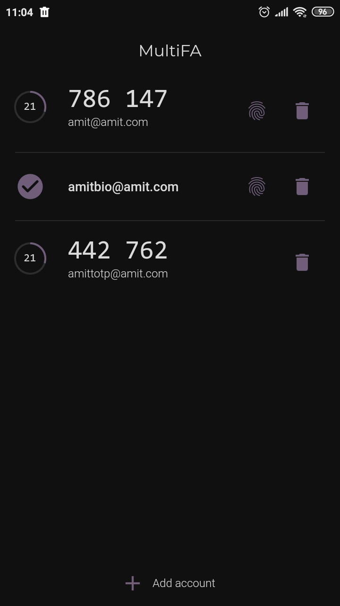
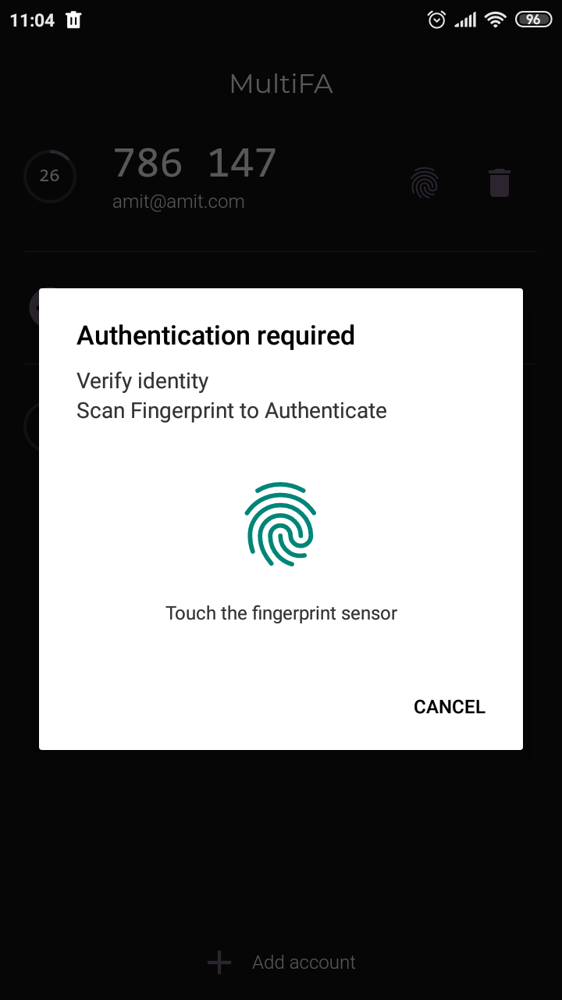
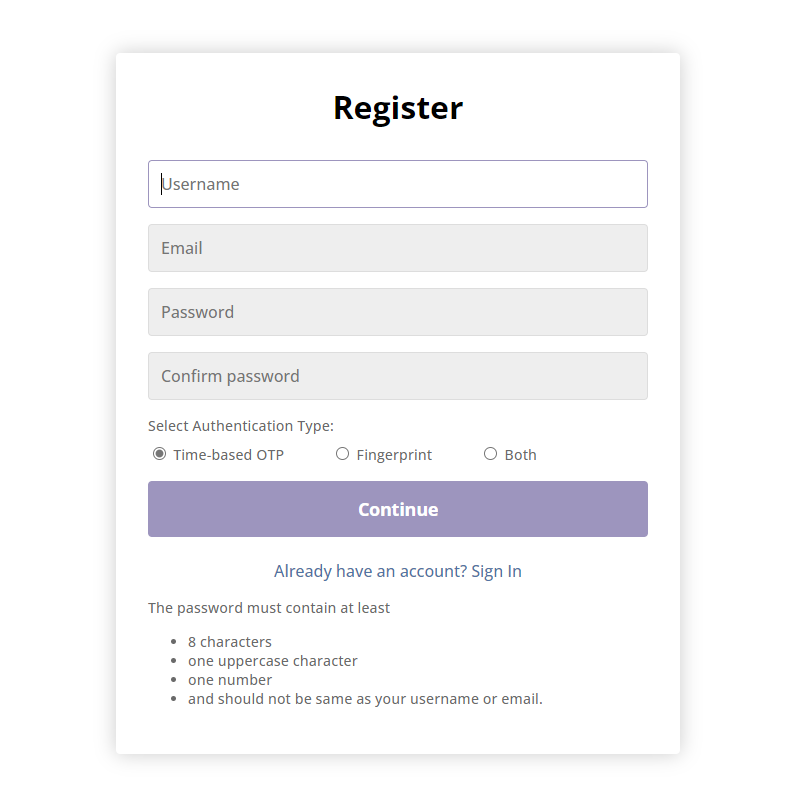

# multiFA
Multi-factor Authentication. The server-side code for this project has been hosted [here](https://multifa.herokuapp.com/).

## Getting Started
### Prerequisites
* [Node.js](https://nodejs.org/en/)
* [Flutter](https://docs.flutter.dev/get-started/install)

#### For Android
* [Android Studio](https://developer.android.com/studio)

#### For Typescript
These should be globally installed:
* [TypeScript](https://www.typescriptlang.org/download) `npm install -g typescript`
* [ts-node](https://www.npmjs.com/package/ts-node) `npm install -g ts-node`

### Installation
* Create a file called `.env` in the `server` folder and copy the contents below. Generate public and private keys using [RSA key generator](https://travistidwell.com/jsencrypt/demo/) and also create a MongoDB cluster using [MongoDB Atlas](https://www.mongodb.com/atlas), replace them to their respective places. The contents of the `.env` file:
	```
	DB_URI = '<ENTER_YOUR_MONGODB_URI_HERE>'

	PORT = 5000
	HOST = 'localhost'

	PRIVATE_KEY = '<ENTER_YOUR_PRIVATE_KEY_HERE>'

	PUBLIC_KEY = '<ENTER_YOUR_PUBLIC_KEY_HERE>'
	```

(Type these commands by opening the command prompt (for Windows) in the root directory of this repository.)
* This installs the project packages.
	```
	cd server
	npm install
	cd ../app
	flutter pub get
	```
	OR (for Windows),
	```
	./install.bat
	```
### Build
#### Server-side code
(Type these commands by opening the command prompt (for Windows) in the root directory of this repository.)
* To start the server (runs nodemon for `src/server/app.ts`). This will directly run the typescript files without building javascript files.
	```
	cd server
	npm run server
	```
	OR (for Windows),
	```
	./server.bat
	```
* You can then open `http://localhost:5000`.

OR,
* To build and run javascript files 
	```
	cd server
	npm run build
	npm run server-js
	```
	OR (for Windows),
	```
	./server-build.bat
	```
* You can then open `http://localhost:5000`.

#### Android Application
> Warning! In .pub-cache\hosted\pub.dartlang.org\flutter_barcode_scanner-2.0.0\android\src\main\java\com\amolg\flutterbarcodescanner\FlutterBarcodeScannerPlugin.java replace all references of FlutterActivity to FlutterFragmentActivity. This is because the local_auth package uses FlutterFragmentActivity and flutter_barcode_scanner uses FlutterActivity.

* Create and open an [Android Virtual Device (AVD)](https://developer.android.com/studio/run/managing-avds) in Android Studio.

* OR, you can also configure [USB Debugging](https://developer.android.com/studio/debug/dev-options).

(Type these commands by opening the command prompt (for Windows) in the root directory of this repository.)
* Build and run the project using the following command:
	```
	cd app
	flutter run
	```
	OR (for Windows),
	```
	./app.bat
	```
* OR, use vscode [flutter](https://marketplace.visualstudio.com/items?itemName=Dart-Code.flutter) extension.

* Build and run app in release mode
	```
	cd app
	flutter run --release
	```
	OR (for Windows),
	```
	./app-rel.bat
	```
* You can also clean (deleting build files and other generated files) the flutter project using the following command.
	```
	cd app
	flutter clean
	```
	OR (for Windows)
	```
	./app-clean.bat
	```


## Output
* **Website:** https://multifa.herokuapp.com/
* **Android App:** https://github.com/amitshky/multiFA/releases

### Android Application
* Home page\
	

* Fingerprint verification\
	

* QR code scan page\
	


### User Registration
* Open `multifa.herokuapp.com/register`\
	

#### TOTP Registration
* After login:\
	

#### Fingerprint Registration
* After login:\
	

### Login
* Open `multifa.herokuapp.com/login`\
	

#### TOTP verification
* After login:\
	

#### Fingerprint verification
* After login:\
	

#### Profile
* After login:\
	


